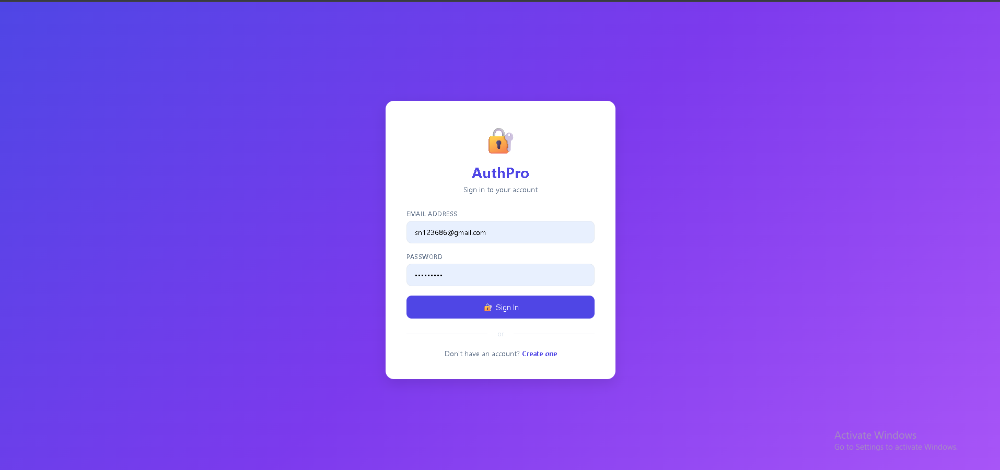
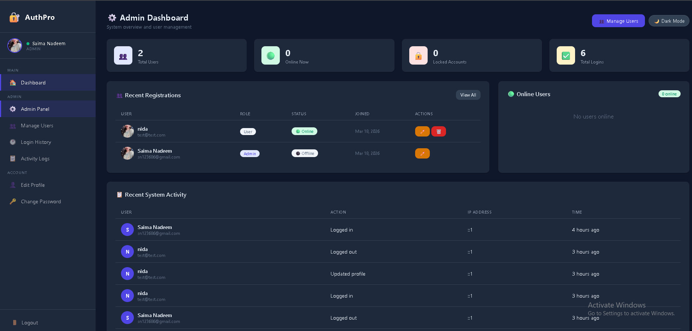
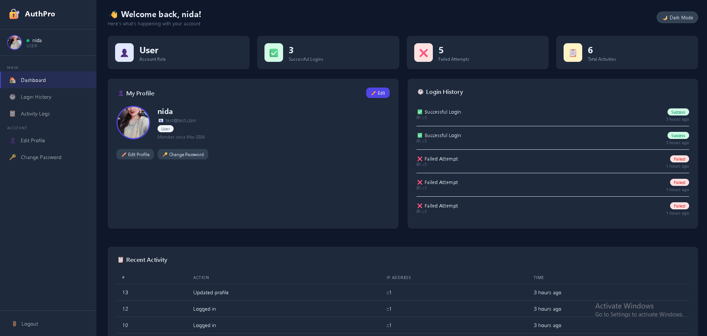
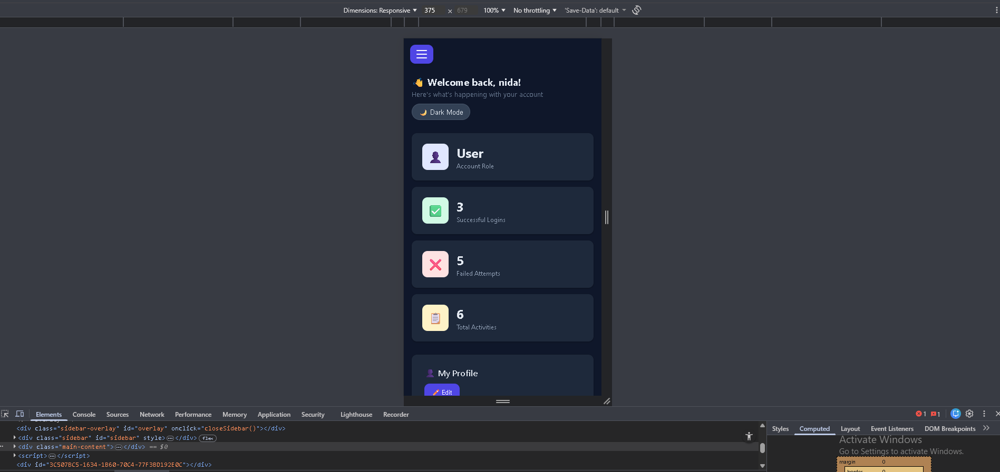

# 🔐 AuthPro — Login & Registration System


A fully-featured, professional Login & Registration System built with pure PHP and MySQL — no frameworks. Demonstrates real-world authentication, role-based access control, security features, and clean UI/UX design.

---

## 🌟 Live Demo

> Register a new account to explore User Dashboard
> Set role to `admin` in database to explore Admin features

---

## ✨ Features

### 🔐 Authentication
- User Registration with full input validation
- Secure Login with session-based authentication
- Logout with complete session destruction
- Password hashing with bcrypt (PASSWORD_DEFAULT)
- Account locking after 5 failed attempts (15 min lockout)
- Remaining attempts warning on failed login

### 👥 Role-Based Access Control
- Admin & User roles
- Protected routes — redirect unauthorized users
- Admin-only pages and features
- Users restricted to their own data only

### 📊 Dashboard System
- Admin Dashboard with system-wide stats
- User Dashboard with personal account stats
- Real-time online status tracking
- Last seen timestamps

### 🔎 User Management (Admin Only)
- View all registered users
- Search by name or email
- Filter by role or account status
- Pagination (10 users per page)
- Edit user details & role
- Lock / Unlock accounts
- Delete users (with self-delete protection)

### 🧾 Profile Management
- Edit profile (name, email)
- Upload profile picture (JPG, PNG, GIF, WEBP — max 2MB)
- Change password with current password verification
- Password strength meter (Weak / Fair / Good / Strong)

### 🔐 Security Features
- SQL Injection prevention (prepared statements)
- XSS protection (htmlspecialchars on all output)
- CSRF token protection on all forms
- Secure session handling
- Input sanitization on all inputs
- File upload validation (type + size)

### 📜 Activity & Logs
- Login history (success & failed attempts with IP)
- User activity logs with timestamps
- Admin sees all users' logs
- Users see only their own logs

### 🎨 UI/UX
- Fully responsive (mobile, tablet, desktop)
- Dark / Light mode toggle (persists after refresh)
- Password strength indicator
- Clean professional dashboard UI
- Hamburger menu on mobile
- Online status indicators

---

## 🛠️ Tech Stack

| Technology | Usage |
|------------|-------|
| PHP 8.2 | Backend logic, sessions, authentication |
| MySQL | Database with foreign keys & prepared statements |
| HTML5 | Structure and semantic markup |
| CSS3 | Custom styling with CSS variables & dark mode |

---

## 🔒 Security Implementation

| Security Feature | Implementation |
|-----------------|----------------|
| SQL Injection | Prepared statements (mysqli_prepare) |
| XSS | htmlspecialchars() on all output |
| CSRF | Token generation & verification |
| Passwords | password_hash() & password_verify() |
| Sessions | session_regenerate_id() on login |
| File Uploads | Extension & size validation |
| Brute Force | Account locking after 5 attempts |

---

## 📁 Project Structure
```
auth-pro/
├── config/
│   └── config.php              # DB connection, constants, helper functions
├── includes/
│   ├── header.php              # Reusable HTML head
│   ├── sidebar.php             # Reusable navigation sidebar
│   └── footer.php              # JS, dark mode, hamburger scripts
├── admin/
│   ├── dashboard.php           # Admin dashboard with stats
│   ├── users.php               # User management with search & pagination
│   ├── edit_user.php           # Edit user details & role
│   └── delete_user.php         # Delete user handler
├── profile/
│   ├── edit.php                # Edit profile + image upload
│   └── change_password.php     # Secure password change
├── assets/
│   └── style.css               # Complete stylesheet with dark mode
├── uploads/
│   └── profiles/               # User profile images
├── screenshots/                # Project screenshots
├── index.php                   # Entry point — redirects by role
├── login.php                   # Login page with CSRF & brute force protection
├── register.php                # Registration with password strength meter
├── logout.php                  # Secure logout handler
├── dashboard.php               # User dashboard
├── login_history.php           # Login history with pagination
└── activity_logs.php           # Activity logs with filter & pagination
```

---

## ⚙️ Installation & Setup

### Prerequisites
- XAMPP (Apache + MySQL + PHP 8.x)

### Steps

**1. Clone the repository**
```bash
git clone https://github.com/sn123686-dev/auth-pro.git
cd auth-pro
```

**2. Create the database**

Open phpMyAdmin and run:
```sql
CREATE DATABASE auth_system;
USE auth_system;

CREATE TABLE users (
    id INT AUTO_INCREMENT PRIMARY KEY,
    name VARCHAR(100) NOT NULL,
    email VARCHAR(100) NOT NULL UNIQUE,
    password VARCHAR(255) NOT NULL,
    role ENUM('admin', 'user') DEFAULT 'user',
    profile_image VARCHAR(255) NULL,
    is_locked TINYINT(1) DEFAULT 0,
    failed_attempts INT DEFAULT 0,
    locked_until DATETIME NULL,
    last_seen DATETIME NULL,
    created_at TIMESTAMP DEFAULT CURRENT_TIMESTAMP
);

CREATE TABLE activity_logs (
    id INT AUTO_INCREMENT PRIMARY KEY,
    user_id INT NOT NULL,
    action VARCHAR(255) NOT NULL,
    ip_address VARCHAR(45),
    created_at TIMESTAMP DEFAULT CURRENT_TIMESTAMP,
    FOREIGN KEY (user_id) REFERENCES users(id) ON DELETE CASCADE
);

CREATE TABLE login_history (
    id INT AUTO_INCREMENT PRIMARY KEY,
    user_id INT NOT NULL,
    ip_address VARCHAR(45),
    status ENUM('success', 'failed') NOT NULL,
    created_at TIMESTAMP DEFAULT CURRENT_TIMESTAMP,
    FOREIGN KEY (user_id) REFERENCES users(id) ON DELETE CASCADE
);
```

**3. Create config file**

Create `config/config.php` with your database credentials:
```php
<?php
define('DB_HOST', 'localhost');
define('DB_USER', 'root');
define('DB_PASS', '');
define('DB_NAME', 'auth_system');
define('APP_NAME', 'AuthPro');
define('APP_URL', 'http://localhost/auth-pro');
define('MAX_LOGIN_ATTEMPTS', 5);
define('LOCK_TIME', 15);
?>
```

**4. Create uploads folder**
```bash
mkdir uploads/profiles
```

**5. Visit the app**
```
http://localhost/auth-pro/login.php
```

**6. Create admin account**

Register normally, then go to phpMyAdmin → users table → set your role to `admin`

---

## 📸 Screenshots

### Login Page


### Admin Dashboard


### User Dashboard


### Mobile View


---

## 👩‍💻 Author

**Saima Nadeem**
- GitHub: [@sn123686-dev](https://github.com/sn123686-dev)
- Location: Islamabad, Pakistan

---

## 📄 License

This project is open source and available under the [MIT License](LICENSE).